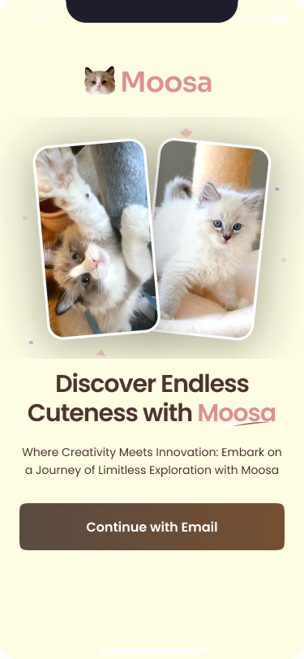
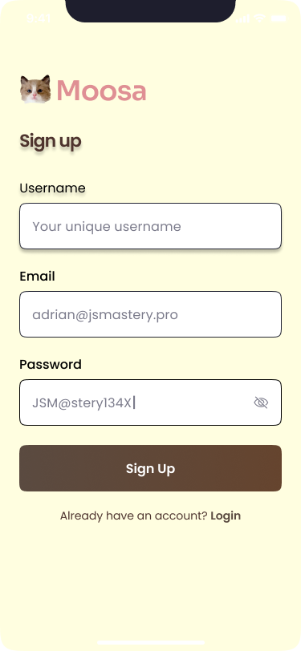

# Moosa - Video Sharing Mobile App for Pets 🐾  

  

Moosa is a mobile application designed to bring pet lovers together by providing a fun and interactive **video-sharing platform**. Inspired by my beloved kitty **Moose** and my name, **Masa**, Moosa is all about celebrating the joy of pets through videos. 🐱🐶  

## Features  

- 📱 **Cross-Platform Support** – Built with React Native and Expo for seamless performance on both iOS and Android.  
- 🎥 **Video Upload & Sharing** – Users can upload and share pet videos with a community of fellow pet lovers.  
- 🔒 **User Authentication** – Secure sign-up and login using **email and password** (Appwrite Authentication).  
- 🌐 **Cloud Storage** – All videos are stored safely in **Appwrite's storage**.  
- ❤️ **Social Features** – Users can like videos, explore a **feed**, use a **search feature**, and maintain a **profile**.  

## Screenshots 📸  

| Home Feed | Upload Screen |
|-----------|--------------|
|  |  |

## Tech Stack  

- **Frontend**: React Native, JavaScript, Expo  
- **Backend**: Appwrite (Database, Authentication, Storage)  
- **Design**: Figma (for UI components)  

